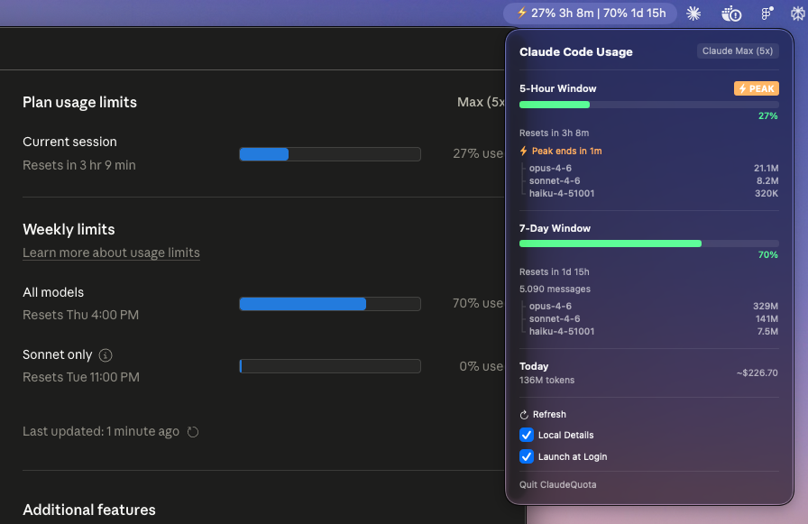

# ClaudeQuota

A lightweight macOS menu bar app that shows your [Claude Code](https://claude.ai/code) quota usage in real time.



## Features

- **Exact percentages** — reads directly from Anthropic's internal quota API, same numbers Claude Code shows
- **Live countdown** — 5-hour and 7-day reset timers tick down in real time
- **Color coded** — green → orange → red as you approach limits
- **Peak hours indicator** — ⚡ badge during weekday peak hours (5am–11am PT) when 5-hour limits are consumed faster
- **Model breakdown** — per-model token counts from local session files (toggle off for pure API-only mode)
- **Today's cost** — estimated USD spend based on published Anthropic pricing
- **Zero config** — reads Claude Code's existing keychain credentials, no setup required

## Requirements

- macOS 14 (Sonoma) or later
- [Claude Code](https://claude.ai/code) installed and logged in

## Installation

### Download (recommended)

1. Download `ClaudeQuota.zip` from the [latest release](../../releases/latest)
2. Unzip and drag `ClaudeQuota.app` to `/Applications`
3. Open it — if macOS blocks it, right-click → Open

If you see "unidentified developer":
```bash
xattr -cr /Applications/ClaudeQuota.app
```

### Build from source

Requires Xcode Command Line Tools (`xcode-select --install`).

```bash
git clone https://github.com/joinnow-io/claude-quota.git
cd claude-quota
swift build -c release
```

The binary is at `.build/release/ClaudeQuota`. To create a proper `.app` bundle:

```bash
bash scripts/make-app.sh
# → dist/ClaudeQuota.app
```

## How it works

| Data | Source |
|------|--------|
| 5h / 7d utilization percentages | Anthropic quota API (`/api/oauth/usage`) |
| Reset timestamps | Anthropic quota API |
| Per-model token breakdown | Local JSONL files (`~/.claude/projects/`) |
| Today's tokens + cost estimate | Local JSONL files |
| Plan / tier info | macOS Keychain (`Claude Code-credentials`) |
| Peak hours | Computed locally (weekdays 12:00–18:00 UTC); see [Peak hours](#peak-hours) |

The app uses Claude Code's existing OAuth token from the macOS Keychain — no separate login or API key needed. The token is automatically refreshed when it expires.

The **Local Details** toggle in the dropdown enables/disables JSONL scanning. When off, the app uses only the API — no file system access, no file watcher.

## API usage

The quota endpoint (`/api/oauth/usage`) is an undocumented internal API. To be a good citizen:

- Quota is fetched at startup, then **every 60 seconds**
- A minimum of **30 seconds** is enforced between any two calls
- On a `429 Too Many Requests` response the app backs off for **5 minutes** before retrying
- The manual **Refresh** button always fires immediately and clears any active backoff

## Peak hours

Anthropic adjusts 5-hour session limits for Free, Pro, and Max plans during **weekday peak hours: 5 am–11 am PT (8 am–2 pm ET / 12:00–18:00 UTC)**. During this window, token costs against the 5-hour budget are effectively higher — the allowance depletes faster than wall-clock time. Weekly limits are unchanged; only the 5-hour distribution shifts.

ClaudeQuota shows a ⚡ badge in the menu bar during peak hours and a countdown to the next transition.

Key details:

- **Affected plans:** Free, Pro ($20/mo), Max 5x ($100/mo), Max 20x ($200/mo). API customers are not affected.
- **Off-peak benefit:** Anthropic expanded off-peak capacity to compensate for the tighter peak-hour budget.
- **Recommendation:** Shift token-intensive background jobs (bulk refactors, large code generation) to off-peak hours.

Sources: [Anthropic help center](https://support.claude.com/en/articles/11145838-using-claude-code-with-your-max-plan) · [The Register](https://www.theregister.com/2026/03/26/anthropic_tweaks_usage_limits/) · [GitHub issue #38335](https://github.com/anthropics/claude-code/issues/38335)

## Privacy

- No data leaves your machine except the single quota API call to `api.anthropic.com`
- Reads Claude Code's keychain entry (`Claude Code-credentials`) — same credentials the CLI uses
- Does not modify any Claude Code settings or config files

## Release pipeline

Tagged releases are built automatically via GitHub Actions on a macOS runner:

```bash
git tag v1.0.0
git push origin v1.0.0
```

The pipeline builds a release binary, packages it as a `.app` bundle, and attaches it to the GitHub Release. If signing secrets are configured the app is also signed and notarized (no Gatekeeper warnings).

### Signing secrets (optional)

Add these to **GitHub → Settings → Secrets → Actions** to enable signing and notarization:

| Secret | Description |
|--------|-------------|
| `CERTIFICATE_BASE64` | Developer ID cert exported as `.p12`, base64 encoded |
| `CERTIFICATE_PASSWORD` | Password for the `.p12` |
| `NOTARYTOOL_APPLE_ID` | Apple ID email |
| `NOTARYTOOL_PASSWORD` | App-specific password from appleid.apple.com |
| `NOTARYTOOL_TEAM_ID` | 10-character Apple Team ID |

## Project structure

```
Sources/ClaudeQuota/
  ClaudeQuotaApp.swift          # App entry point, MenuBarExtra
  Model/
    QuotaStore.swift            # Central state, API + local data coordination
    UsageData.swift             # Data models
    UsageAggregator.swift       # JSONL scanner and token aggregator
    RateLimitWindow.swift       # 5h/7d window boundary calculations
    PeakHours.swift             # Peak hours detection and countdown
    PlanLimits.swift            # Plan/tier defaults
  Service/
    KeychainService.swift       # Read Claude Code OAuth credentials
    UsageAPIService.swift       # Quota API client with auto token refresh
  Views/
    UsageMenuView.swift         # Dropdown menu UI
    SettingsView.swift          # Settings window
  Utilities/
    FileWatcher.swift           # FSEvents directory watcher
    Formatting.swift            # Token/time/percentage formatting
    CostEstimator.swift         # USD cost from token counts
    LaunchAtLogin.swift         # SMAppService launch at login
```

## License

MIT
